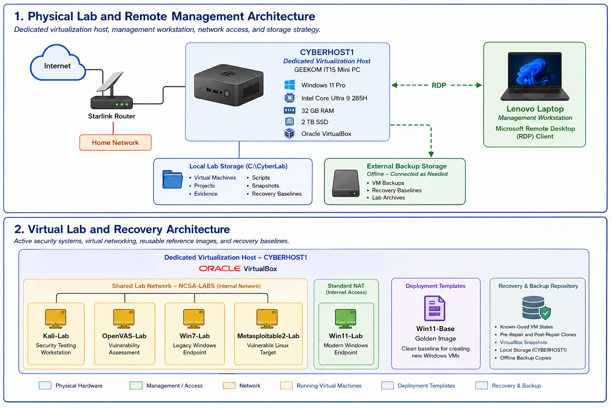

\# Project 001 – Personal Cybersecurity Home Lab

\## Overview

This project documents the design, implementation, and ongoing development of my personal cybersecurity home lab. The lab serves as a dedicated environment for developing hands-on experience with system administration, networking, vulnerability assessment, penetration testing, digital forensics, and incident response while providing a safe platform for testing security tools and techniques.

The environment is hosted on a dedicated GEEKOM IT15 Mini PC running Windows 11 Pro with Oracle VirtualBox as the virtualization platform. Administrative access is performed remotely from a Lenovo laptop using Microsoft Remote Desktop (RDP), allowing the lab to operate independently as a dedicated virtualization host.

The lab currently includes multiple virtual machines that simulate a small enterprise environment, including Kali Linux, OpenVAS, Windows 11, Windows 7, and Metasploitable2. A dedicated Windows 11 Golden Image is maintained as a deployment template to support rapid provisioning of new virtual machines, while recovery baselines, snapshots, and offline backups provide a repeatable and recoverable testing environment.

This home lab serves as the foundation for every project contained within this portfolio. Future projects—including network enumeration, packet analysis, vulnerability management, exploitation, memory forensics, and digital investigations—are performed within this environment and build upon the infrastructure documented here.

As my cybersecurity knowledge and technical skills continue to grow, this lab will evolve to incorporate additional technologies, services, and defensive capabilities while maintaining a structured, well-documented, and repeatable environment for learning and experimentation.

\## Lab Architecture

The home lab is designed as a dedicated virtualization environment that provides a controlled platform for learning, testing, and validating cybersecurity concepts. The architecture separates physical infrastructure, virtual systems, storage, and recovery components to create a repeatable environment for security testing, research, and hands-on experimentation.

The environment is centered around \*\*CYBERHOST1\*\*, a dedicated Windows 11 Pro virtualization host running Oracle VirtualBox. Administrative management is performed remotely from a Lenovo laptop using Microsoft Remote Desktop (RDP), allowing the host to operate independently while simplifying day-to-day administration.

Within VirtualBox, multiple virtual machines simulate systems commonly encountered in enterprise environments, including attacker workstations, vulnerable targets, Windows endpoints, and vulnerability management platforms. Network connectivity is configured to provide both isolated internal communication and Internet access where required for testing.

To support repeatable deployments and rapid recovery, the lab incorporates a dedicated Windows 11 Golden Image, VirtualBox snapshots, recovery baselines, locally stored virtual machine files, and offline backups maintained on external storage.

Figure 1 illustrates the overall architecture of the cybersecurity home lab.

&#x20; 

\## Objectives

The primary objectives of this home lab are to:

\- Develop practical cybersecurity and system administration skills through hands-on experience in a controlled environment.

\- Build proficiency with security, networking, vulnerability assessment, penetration testing, and digital forensics tools.

\- Simulate common enterprise systems and security scenarios using dedicated virtual machines.

\- Provide a repeatable platform for network analysis, vulnerability testing, exploitation validation, incident investigation, and forensic analysis.

\- Maintain standardized deployment, recovery, and backup processes that support reliable lab operations.

\- Produce clear, professional technical documentation for the projects contained within this portfolio.

\- Expand the environment over time as new technologies, tools, and security concepts are introduced.

\## Host Hardware

The home lab is hosted on \*\*CYBERHOST1\*\*, a dedicated \*\*GEEKOM IT15 Mini PC\*\* configured specifically for virtualization and cybersecurity testing.

| Component | Specification |

|---|---|

| \*\*Host Name\*\* | CYBERHOST1 |

| \*\*System Role\*\* | Dedicated Virtualization Host |

| \*\*Operating System\*\* | Windows 11 Pro |

| \*\*Processor\*\* | Intel Core Ultra 9 285H |

| \*\*Memory\*\* | 32 GB RAM |

| \*\*Storage\*\* | 2 TB SSD |

| \*\*Virtualization Platform\*\* | Oracle VirtualBox |

The system provides the processing capacity, memory, and storage required to operate multiple virtual machines while supporting vulnerability scanning, network analysis, penetration testing, and digital forensics workloads.

Administrative access is performed remotely from a Lenovo laptop using Microsoft Remote Desktop (RDP). The Lenovo laptop functions only as a management workstation and is not considered part of the lab infrastructure.

\## Software \& Platforms

The home lab utilizes a combination of commercial and open-source software to support virtualization, system administration, vulnerability management, penetration testing, network analysis, digital forensics, and project documentation.

| Software | Purpose |

|---|---|

| \*\*Windows 11 Pro\*\* | Host operating system for the virtualization environment. |

| \*\*Oracle VirtualBox\*\* | Virtualization platform used to create and manage the lab infrastructure. |

| \*\*Microsoft Remote Desktop (RDP)\*\* | Remote administration of the virtualization host from the management workstation. |

| \*\*Kali Linux\*\* | Security testing platform containing penetration testing and network analysis tools. |

| \*\*OpenVAS (Greenbone)\*\* | Vulnerability management and security assessment platform. |

| \*\*Git\*\* | Version control for project documentation and portfolio development. |

| \*\*GitHub\*\* | Repository hosting and version management for the cybersecurity portfolio. |

Additional software, security tools, and operating systems will be incorporated into the environment as new projects expand the capabilities of the lab.

\## Virtual Machine Inventory

The lab consists of multiple virtual machines that represent systems commonly found within enterprise environments. Each virtual machine serves a specific role while providing a safe and isolated environment for developing practical cybersecurity skills.

| Virtual Machine | Operating System | Primary Role |

|---|---|---|

| \*\*Kali-Lab\*\* | Kali Linux | Security workstation used for penetration testing, enumeration, packet analysis, and security assessments. |

| \*\*OpenVAS-Lab\*\* | Greenbone/OpenVAS | Vulnerability management platform used to perform authenticated and unauthenticated security scans. |

| \*\*Win11-Lab\*\* | Windows 11 | Modern Windows endpoint used for administration, defensive testing, and endpoint security exercises. |

| \*\*Win7-Lab\*\* | Windows 7 | Legacy Windows system maintained for compatibility and security testing scenarios. |

| \*\*Metasploitable2-Lab\*\* | Linux | Intentionally vulnerable target used for exploitation, vulnerability validation, and penetration testing exercises. |

| \*\*Win11-Base\*\* | Windows 11 | Golden Image maintained as the standardized deployment template for future Windows virtual machines. |

Each virtual machine is configured to support specific learning objectives while maintaining isolation from production systems. This approach enables repeatable testing, experimentation, and recovery without impacting the underlying host operating system.

\## Storage Strategy

The cybersecurity lab uses a structured storage strategy to organize project documentation, virtual machines, supporting resources, and recovery data.

The primary workspace is located at \*\*C:\\CyberLab\*\*, which serves as the central repository for projects, scripts, evidence, documentation, virtual machine resources, and supporting files.

An external hard drive is used exclusively for offline backups of important lab resources. The drive is connected only when backup or restoration operations are performed, reducing the risk of accidental modification, corruption, or data loss.

This storage strategy provides a centralized workspace for day-to-day lab operations while maintaining separate offline recovery media for long-term protection of the environment.

\## Deployment Templates

To promote consistency across the environment, the lab maintains a standardized Windows deployment template named \*\*Win11-Base\*\*.

The Golden Image is used as the foundation for creating new Windows virtual machines, allowing systems to be deployed with a known-good configuration while reducing setup time and configuration inconsistencies.

Using a standardized deployment template provides several operational benefits, including:

\- Consistent system configurations across new deployments.

\- Faster provisioning of additional virtual machines.

\- Simplified recovery following testing or system failures.

\- Reduced time required to build future lab environments.

Maintaining a dedicated Golden Image helps ensure that future projects begin from a stable and repeatable baseline.

