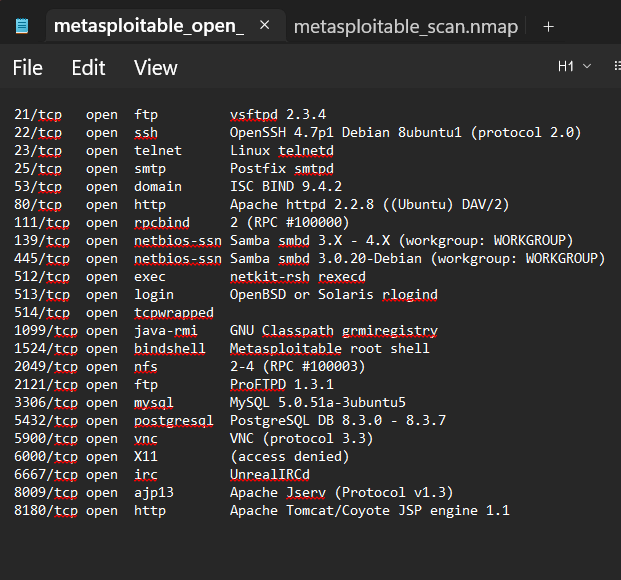
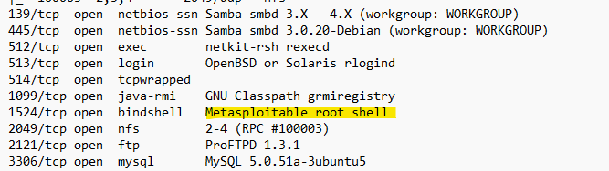
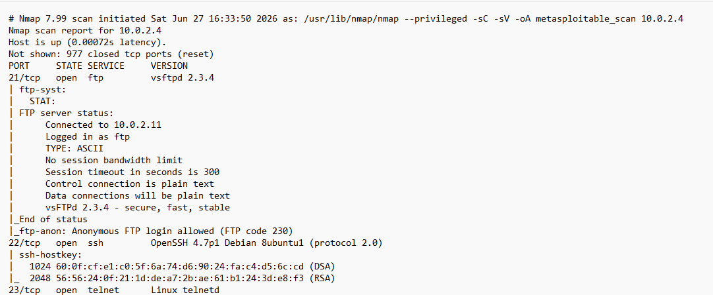
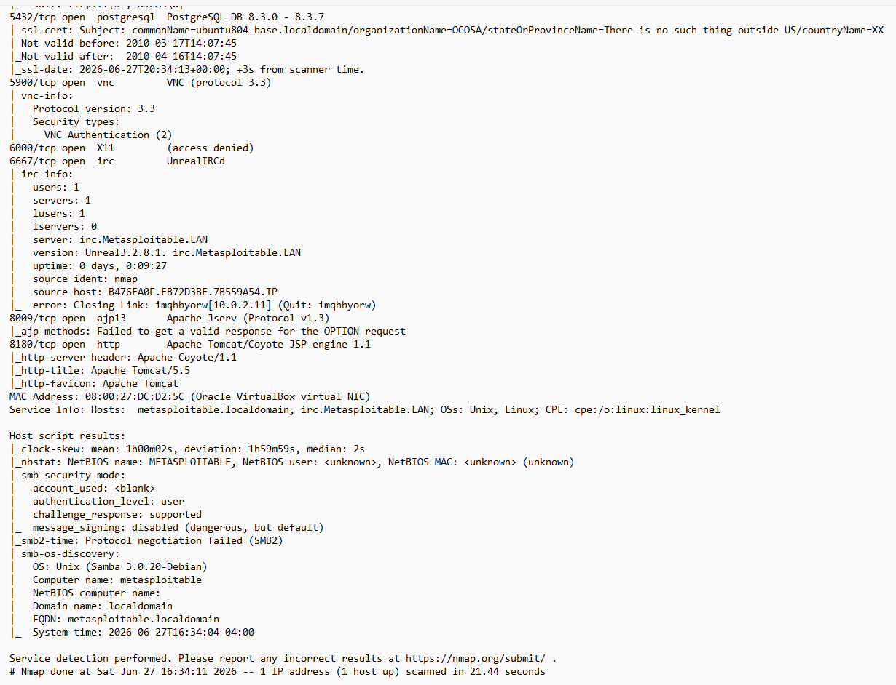

# Project 002 – Nmap Network Enumeration and Service Discovery


## Overview


This project documents the use of Nmap to perform network enumeration and service discovery against a Metasploitable2 virtual machine within an isolated cybersecurity lab environment. The assessment focused on identifying exposed TCP ports, determining the services and software versions running on the target, and reviewing Nmap script results for potential security concerns.


The target system, **Metasploitable2 (10.0.2.4)**, is an intentionally vulnerable Linux virtual machine designed for security training and penetration testing. The scan was performed from a security testing workstation within the lab environment, ensuring that all enumeration activity remained isolated from production systems.


Nmap was configured to perform default script scanning and service/version detection while saving the results in multiple output formats for later analysis. The scan identified **23 open TCP ports** and exposed numerous network services, including FTP, SSH, Telnet, HTTP, SMB, NFS, MySQL, PostgreSQL, VNC, IRC, and Apache Tomcat.


Further analysis of the scan results identified several security-relevant findings, including **anonymous FTP access**, an exposed **Metasploitable root shell**, legacy network services, and **disabled SMB message signing**. These findings demonstrate how network enumeration can be used to map a system's attack surface and identify services that warrant additional investigation.


This project demonstrates a practical enumeration workflow consisting of target scanning, service identification, result analysis, evidence preservation, and documentation of security-relevant findings.


## Objectives


The primary objectives of this project were to:


- Perform network enumeration against an authorized target within an isolated lab environment.

- Identify open TCP ports and exposed network services using Nmap.

- Determine service and software version information to better understand the target's attack surface.

- Use Nmap's default scripting capabilities to gather additional information about discovered services.

- Identify security-relevant configurations and services that warrant further investigation.

- Preserve scan results in multiple formats to support analysis, evidence collection, and documentation.

- Develop practical experience interpreting Nmap output and prioritizing findings during the reconnaissance and enumeration phase of a security assessment.


## Lab Environment


The assessment was conducted within the isolated virtual environment documented in **Project 001 – Personal Cybersecurity Home Lab**.


| Component | Role |

|---|---|

| **Kali Linux** | Security testing workstation used to perform the Nmap scan and analyze results. |

| **Metasploitable2** | Intentionally vulnerable Linux system used as the authorized enumeration target. |

| **Target IP Address** | 10.0.2.4 |

| **Virtualization Platform** | Oracle VirtualBox |

| **Lab Network** | NCSA-LABS |

| **Primary Tool** | Nmap 7.99 |


All scanning activity was performed against an intentionally vulnerable virtual machine within the controlled lab environment.


## Methodology


The assessment began by performing an Nmap scan against the Metasploitable2 target at **10.0.2.4**. The scan combined service/version detection with Nmap's default NSE scripts to identify exposed services and collect additional information about their configurations.


The scan results were then reviewed to identify open TCP ports, running services, detected software versions, and security-relevant script results. Particular attention was given to services or configurations that increased the target's attack surface or warranted additional investigation.


Nmap output was preserved in normal, grepable, and XML formats to maintain the original scan results and support later analysis. A simplified open-port summary and selected screenshots were also retained as supporting evidence.


The enumeration results were analyzed without modifying the target system. Exploitation and vulnerability validation activities are documented separately in other portfolio projects where applicable.


## Nmap Command & Options


The primary enumeration scan was performed against the Metasploitable2 target using the following Nmap configuration:


```bash

nmap -sC -sV -oA metasploitable_scan 10.0.2.4

```


The scan options provided the following functionality:


| Option | Purpose |

|---|---|

| **-sC** | Executes Nmap's default NSE scripts against discovered services to collect additional information and identify noteworthy configurations. |

| **-sV** | Performs service and version detection against open ports. |

| **-oA metasploitable_scan** | Saves the scan results in Nmap's normal, grepable, and XML output formats using the `metasploitable_scan` filename. |

| **10.0.2.4** | Specifies the Metasploitable2 virtual machine as the target of the scan. |


The resulting scan artifacts were preserved in the `Results` directory as `metasploitable_scan.nmap`, `metasploitable_scan.gnmap`, and `metasploitable_scan.xml`.


## Scan Results


The Nmap scan confirmed that the target was online and identified **23 open TCP ports**, with 977 additional TCP ports reported as closed.


| Port | Service | Detected Version / Description |

|---|---|---|

| **21/tcp** | FTP | vsftpd 2.3.4 |

| **22/tcp** | SSH | OpenSSH 4.7p1 Debian 8ubuntu1 |

| **23/tcp** | Telnet | Linux telnetd |

| **25/tcp** | SMTP | Postfix smtpd |

| **53/tcp** | DNS | ISC BIND 9.4.2 |

| **80/tcp** | HTTP | Apache httpd 2.2.8 |

| **111/tcp** | RPC | rpcbind 2 |

| **139/tcp** | NetBIOS/SMB | Samba smbd 3.X–4.X |

| **445/tcp** | SMB | Samba smbd 3.0.20-Debian |

| **512/tcp** | exec | netkit-rsh rexecd |

| **513/tcp** | login | rlogind |

| **514/tcp** | TCP wrapped | tcpwrapped |

| **1099/tcp** | Java RMI | GNU Classpath grmiregistry |

| **1524/tcp** | Bind shell | Metasploitable root shell |

| **2049/tcp** | NFS | NFS 2–4 |

| **2121/tcp** | FTP | ProFTPD 1.3.1 |

| **3306/tcp** | MySQL | MySQL 5.0.51a-3ubuntu5 |

| **5432/tcp** | PostgreSQL | PostgreSQL 8.3.0–8.3.7 |

| **5900/tcp** | VNC | VNC protocol 3.3 |

| **6000/tcp** | X11 | Access denied |

| **6667/tcp** | IRC | UnrealIRCd |

| **8009/tcp** | AJP13 | Apache Jserv Protocol 1.3 |

| **8180/tcp** | HTTP | Apache Tomcat/Coyote JSP engine 1.1 |


The number and variety of exposed services demonstrate the intentionally large attack surface presented by the Metasploitable2 system.


## Key Findings


Analysis of the Nmap results identified several findings that warranted additional security attention.


### Anonymous FTP Access


Nmap's default FTP scripts determined that the FTP service on **TCP port 21** permitted anonymous authentication:


```text

ftp-anon: Anonymous FTP login allowed (FTP code 230)

```


Allowing anonymous FTP access can expose files or services to unauthenticated users depending on the permissions and content available through the FTP server.


### Exposed Root Bind Shell


Nmap identified **TCP port 1524** as an exposed bind shell:


```text

1524/tcp open  bindshell  Metasploitable root shell

```


The presence of an exposed root shell represents a significant security concern because the service provides direct command-line access with elevated privileges if successfully accessed.


### Legacy and Exposed Network Services


The target exposed several legacy or security-sensitive services, including **Telnet, r-services, VNC, FTP, and X11**, along with externally reachable database services such as **MySQL and PostgreSQL**.


The presence of these services expands the target's attack surface and provides multiple areas for additional enumeration and security assessment.


### SMB Message Signing Disabled


Nmap's SMB scripts reported that message signing was disabled:


```text

message_signing: disabled (dangerous, but default)

```


SMB signing provides integrity and authenticity protections for SMB communications. Disabling signing can increase exposure to certain interception or manipulation attacks depending on the network configuration and SMB implementation.


### Service and Version Disclosure


Service detection revealed specific software and version information across numerous ports, including **vsftpd 2.3.4, Apache 2.2.8, Samba 3.0.20-Debian, MySQL 5.0.51a, PostgreSQL 8.3.x, and Apache Tomcat 5.5**.


Detailed version information is valuable during security assessments because it enables discovered services to be researched and prioritized for further vulnerability analysis.


## Evidence


The following evidence documents the enumeration process and security-relevant findings identified during the assessment.


### Open Ports and Services


The initial scan results identified **23 open TCP ports** and provided service and version information for the exposed network services.


<p align="center">

&#x20; 

</p>


### Metasploitable Root Shell


Nmap identified an exposed bind shell on **TCP port 1524**, reported as a Metasploitable root shell.


<p align="center">

&#x20; 

</p>


### Anonymous FTP Access


Nmap's default scripts identified that the FTP service on **TCP port 21** permitted anonymous authentication.


<p align="center">

&#x20; 

</p>


### SMB Security Findings


Nmap's SMB scripts identified additional host information and reported that **SMB message signing was disabled**.


<p align="center">

&#x20; 

</p>


### Original Scan Artifacts


The original Nmap output generated during the assessment is preserved in the `Results` directory:


- `metasploitable_scan.nmap` — Normal human-readable Nmap output.

- `metasploitable_scan.gnmap` — Grepable Nmap output.

- `metasploitable_scan.xml` — Structured XML scan output.

- `metasploitable_open_ports.txt` — Simplified open-port and service summary.


Preserving the original scan artifacts provides a record of the enumeration results while allowing the findings presented in this README to be independently reviewed.


## Skills Demonstrated


This project demonstrates practical experience with network reconnaissance, service enumeration, security analysis, and technical documentation in a controlled lab environment.


Key skills demonstrated include:


- **Network Enumeration** – Identified open TCP ports and exposed network services on a target system.

- **Nmap** – Used default NSE scripts and service/version detection to gather detailed information about the target.

- **Service Identification** – Identified services including FTP, SSH, Telnet, HTTP, SMB, NFS, MySQL, PostgreSQL, VNC, IRC, and Apache Tomcat.

- **Attack Surface Analysis** – Evaluated exposed services to identify areas requiring additional security investigation.

- **Security Finding Analysis** – Identified anonymous FTP access, an exposed root bind shell, legacy services, and disabled SMB message signing.

- **NSE Script Interpretation** – Reviewed Nmap script output to identify security-relevant service configurations.

- **Evidence Preservation** – Maintained original Nmap results in normal, grepable, and XML formats along with supporting screenshots.

- **Technical Documentation** – Organized enumeration methodology, results, findings, and supporting evidence into a structured security assessment.


## Conclusion


This project demonstrated how network enumeration can be used to develop an initial understanding of a system's attack surface. Using Nmap, the assessment identified **23 open TCP ports**, determined the services and software versions exposed by the target, and collected additional information through Nmap's default NSE scripts.


Analysis of the results identified several security-relevant findings, including **anonymous FTP access, an exposed root bind shell, legacy network services, and disabled SMB message signing**. These findings illustrate how enumeration provides information that can be used to prioritize services for further vulnerability analysis and security testing.


The project also reinforced the importance of preserving original scan results and documenting findings in a repeatable manner. The enumeration results established a technical baseline that can support additional vulnerability assessment and exploitation activities performed within the authorized lab environment.


