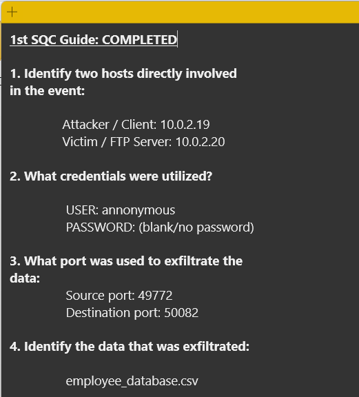
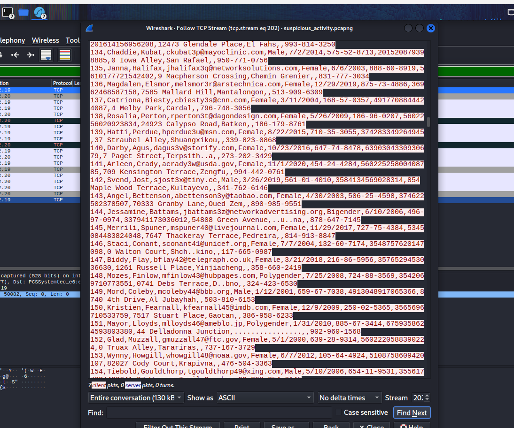

# Project 003 – Wireshark Network Traffic and Data Exfiltration Analysis

## Overview

This project documents the analysis of a packet capture using Wireshark to investigate suspicious FTP network activity. The investigation focused on identifying the systems involved in the communication, examining authentication activity, analyzing the TCP connections associated with the file transfer, and determining what data was transferred across the network.

Analysis of the packet capture identified communication between an FTP client at **10.0.2.19** and an FTP server at **10.0.2.20**. The FTP session permitted anonymous authentication without a password, and subsequent traffic analysis identified the transfer of a file named **employee_database.csv**.

Using Wireshark's TCP stream reconstruction capabilities, the contents of the transferred CSV file could be inspected directly from the captured network traffic. The reconstructed data contained employee records with multiple categories of sensitive information, demonstrating the security risks associated with transmitting data over protocols that do not provide encryption.

This project demonstrates a practical network traffic analysis workflow involving host identification, protocol analysis, credential inspection, TCP stream reconstruction, identification of transferred data, and documentation of security-relevant findings.

## Objectives

The primary objectives of this project were to:

* Analyze a packet capture using Wireshark to investigate suspicious network activity.
* Identify the client and server systems involved in the FTP communication.
* Determine how the FTP session was authenticated and identify credentials visible within the captured traffic.
* Analyze TCP connections associated with the FTP file transfer.
* Identify the network ports used to transfer data between the systems.
* Determine the file transferred during the observed network activity.
* Reconstruct the relevant TCP stream to inspect the transferred data.
* Identify security concerns associated with transmitting sensitive information over an unencrypted protocol.
* Preserve the original packet capture and supporting evidence for documentation and further analysis.
* Develop practical experience using packet analysis techniques applicable to network security monitoring and incident investigation.

## Analysis Environment

The investigation was performed using Wireshark to analyze a provided packet capture containing suspicious FTP network activity.

| Component | Description |
|---|---|
| **Analysis Tool** | Wireshark |
| **Packet Capture** | `suspicious_activity.pcapng` |
| **FTP Client** | 10.0.2.19 |
| **FTP Server** | 10.0.2.20 |
| **Protocol Analyzed** | FTP / TCP |
| **Primary Analysis Technique** | Follow TCP Stream |

The original packet capture was preserved in the `Results` directory to maintain the source evidence used during the investigation.

## Methodology

The investigation began by opening the provided `suspicious_activity.pcapng` packet capture in Wireshark and reviewing the captured network traffic to identify communication associated with the suspicious event.

The TCP communication was analyzed to determine the systems participating in the FTP session. By examining the connection activity and identifying which host initiated the communication, the systems were classified as the FTP client and FTP server.

FTP traffic was then inspected to identify authentication activity and determine how the client accessed the server. The captured traffic revealed that the session used anonymous FTP authentication without a password.

Additional analysis focused on the TCP connections associated with the file transfer. Wireshark's Follow TCP Stream functionality was used to reconstruct relevant network conversations and inspect the application data transmitted between the systems.

The reconstructed traffic revealed the transfer of `employee_database.csv`. Inspection of the TCP stream showed that the transferred file contained employee records with multiple categories of sensitive information.

The original packet capture and supporting screenshots were preserved as evidence of the investigation.

## Investigation Findings

Analysis of the packet capture identified the following key findings:

| Finding | Result |
|---|---|
| **FTP Client** | 10.0.2.19 |
| **FTP Server** | 10.0.2.20 |
| **Authentication Method** | Anonymous FTP |
| **Username** | anonymous |
| **Password** | Blank / no password |
| **Data Transfer Source Port** | 49772 |
| **Data Transfer Destination Port** | 50082 |
| **Transferred File** | `employee_database.csv` |
| **Analysis Technique** | Follow TCP Stream |

These findings established the systems involved in the FTP communication, the authentication method used to access the server, and the network connection associated with the transfer of the employee database.

## FTP Authentication Analysis

Analysis of the FTP communication identified authentication using the username `anonymous`. No password was required for the observed session.

FTP transmits authentication information without encryption, allowing authentication activity to be observed within captured network traffic. In this investigation, inspection of the FTP session provided visibility into how the client authenticated to the server.

The ability to identify authentication information directly from a packet capture demonstrates one of the security limitations associated with using plaintext protocols such as FTP.

## Data Transfer Analysis

The investigation identified a TCP connection associated with the transfer of data between the FTP client and server.

The observed data-transfer connection used:

- **Source Port:** 49772

- **Destination Port:** 50082

Analysis of this connection using Wireshark's Follow TCP Stream functionality allowed the transmitted application data to be reconstructed from the captured packets.

The reconstructed stream revealed the transfer of a CSV file named:

`employee_database.csv`

Inspection of the reconstructed data showed employee records containing multiple categories of sensitive information.

## Sensitive Data Exposure

The reconstructed `employee_database.csv` traffic contained employee information that would be considered sensitive if encountered in a real-world environment.

The observed dataset included categories of information such as:

- Employee names

- Email addresses

- Dates of birth

- Social Security numbers

- Payment card information

- Physical addresses

- Telephone numbers

The ability to reconstruct this information directly from captured network traffic demonstrates the confidentiality risks associated with transmitting sensitive information over an unencrypted protocol.

In a production environment, exposure of this type of information could create significant security, privacy, and compliance concerns.

## Evidence

Supporting evidence was preserved to document the investigation and demonstrate the analysis performed in Wireshark.

### Investigation Findings

The investigation findings summarize the systems involved in the FTP communication, the authentication method observed, the TCP ports associated with the data transfer, and the file identified during the analysis.

### TCP Stream Reconstruction

Wireshark's Follow TCP Stream functionality was used to reconstruct the network conversation associated with the file transfer. The reconstructed stream provided visibility into the contents of `employee_database.csv` as it was transmitted across the network.

### Original Packet Capture

The original packet capture used during the investigation is preserved in the `Results` directory:

`Results/suspicious_activity.pcapng`

Preserving the original capture allows the network traffic to be reviewed again and provides the underlying evidence supporting the documented findings.

## Security Impact and Recommendations

The investigation demonstrates the security risks associated with transmitting authentication information and sensitive data using protocols that do not provide encryption.

In a production environment, the following security measures should be considered:

- Replace plaintext FTP with an encrypted file-transfer solution such as SFTP or FTPS.

- Restrict anonymous access unless it is explicitly required for a documented business purpose.

- Apply network access controls to limit which systems can communicate with file-transfer services.

- Monitor network traffic for unauthorized or unusual file transfers.

- Use data loss prevention and security monitoring controls where appropriate to identify potential exposure of sensitive information.

- Limit access to sensitive employee information according to the principle of least privilege.

- Investigate unexpected transfers of sensitive data as potential security incidents.

Encrypted protocols help protect authentication information and transferred data from being read directly by systems capable of capturing network traffic.

## Skills Demonstrated

This project demonstrates practical experience with:

- Wireshark packet capture analysis

- TCP/IP traffic analysis

- Client and server identification

- FTP protocol analysis

- Cleartext authentication analysis

- TCP port and connection analysis

- Follow TCP Stream

- Network session reconstruction

- File-transfer investigation

- Sensitive data exposure identification

- Network security investigation

- Evidence preservation

- Technical documentation

## Conclusion

Analysis of the packet capture identified FTP communication between **10.0.2.19** and **10.0.2.20**, anonymous authentication without a password, and a TCP connection associated with the transfer of `employee_database.csv`.

Reconstructing the relevant TCP stream in Wireshark demonstrated that the contents of the transferred file could be inspected directly from the captured network traffic. The file contained multiple categories of sensitive employee information, illustrating the confidentiality risks associated with transmitting sensitive data over an unencrypted protocol.

This investigation provided practical experience analyzing network traffic, reconstructing application data, identifying security-relevant activity, and documenting findings from packet-level evidence.

