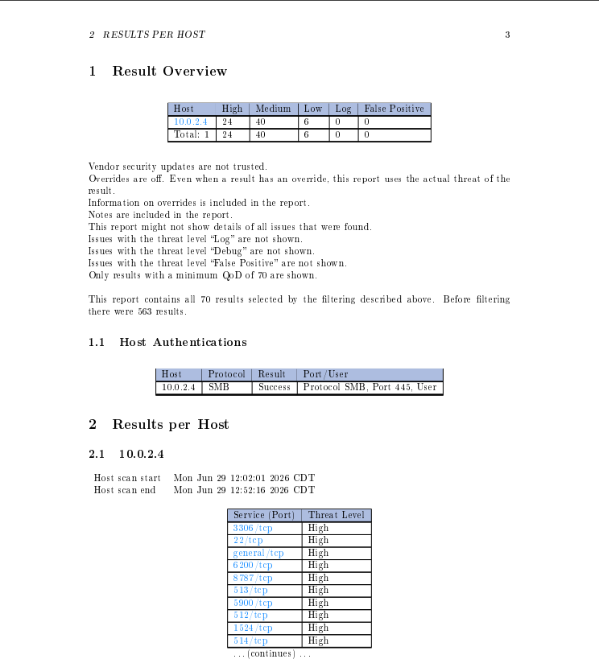
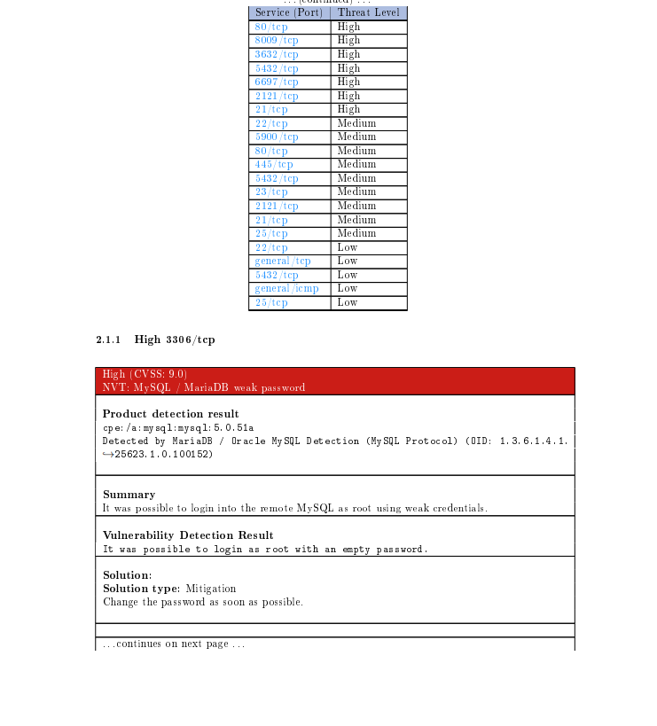
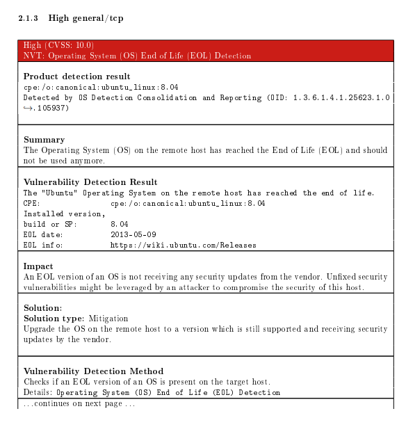
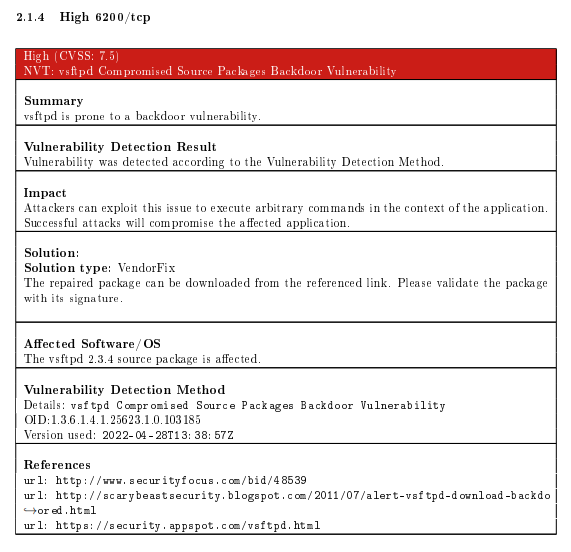
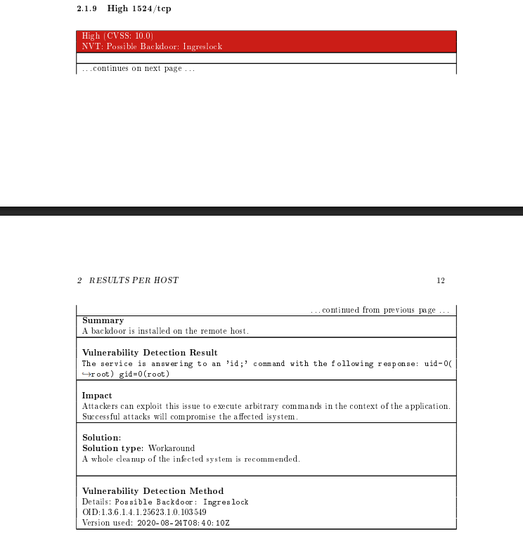

# Project 004 – OpenVAS Vulnerability Assessment


## Overview


This project documents a vulnerability assessment performed with OpenVAS against a Metasploitable2 virtual machine in an isolated cybersecurity lab environment. The objective of the assessment was to identify security vulnerabilities, exposed services, insecure configurations, and outdated software that could increase the target system's attack surface.


The vulnerability scan identified 70 reportable findings, including 24 High, 40 Medium, and 6 Low severity results. Findings included weak authentication controls, unsupported operating system software, vulnerable network services, and potential backdoor services.


Several high-risk findings were analyzed in greater detail, including a MySQL service that permitted root authentication with an empty password, an end-of-life Ubuntu operating system, a vulnerable vsftpd 2.3.4 installation, and a possible backdoor service providing root-level command execution.


The assessment demonstrates a practical vulnerability-management workflow involving automated vulnerability scanning, severity analysis, validation of security findings, evaluation of potential impact, and review of recommended remediation actions.


## Objectives


The primary objectives of this project were to:


- Perform a vulnerability assessment against an authorized target within an isolated lab environment.

- Use OpenVAS to identify known vulnerabilities, insecure configurations, weak authentication controls, and outdated software.

- Review vulnerability findings and evaluate their assigned severity and CVSS scores.

- Identify affected services and systems associated with discovered vulnerabilities.

- Analyze high-risk findings to understand their potential security impact.

- Review scanner-provided remediation guidance for identified vulnerabilities.

- Preserve the original vulnerability assessment report and supporting evidence for documentation and further analysis.

- Develop practical experience with vulnerability scanning, vulnerability prioritization, risk analysis, and remediation planning.


## Assessment Environment


The vulnerability assessment was conducted against the Metasploitable2 virtual machine within the isolated cybersecurity lab environment documented in Project 001.


| Component | Role |
|---|---|
| **OpenVAS / Greenbone** | Vulnerability scanning and assessment platform |
| **Metasploitable2** | Intentionally vulnerable Linux system used as the authorized assessment target |
| **Target IP Address** | 10.0.2.4 |
| **Virtualization Platform** | Oracle VirtualBox |
| **Assessment Type** | Automated vulnerability assessment |
| **Original Report** | `Reports/OpenVAS-Vulnerability-Assessment-Report.pdf` |


All vulnerability scanning activity was performed against an intentionally vulnerable virtual machine within the controlled lab environment.


## Methodology


The assessment began by configuring OpenVAS to scan the Metasploitable2 target at **10.0.2.4**. The scan was performed within the isolated lab environment to identify vulnerabilities and security weaknesses associated with the services and software exposed by the target system.


After the scan completed, the generated results were reviewed to identify findings based on severity, CVSS score, affected service, vulnerability description, and potential security impact. Particular attention was given to High-severity findings and vulnerabilities that could provide unauthorized access or remote command execution.


Selected findings were examined in greater detail to understand how OpenVAS detected the vulnerability, what evidence supported the finding, and what remediation actions were recommended.


The original OpenVAS vulnerability assessment report was preserved in PDF format, and selected findings were retained as supporting evidence for this project.


## Scan Results


The OpenVAS assessment produced **70 reportable findings** against the Metasploitable2 target.


| Severity | Findings |
|---|---:|
| **High** | 24 |
| **Medium** | 40 |
| **Low** | 6 |
| **Total** | 70 |


The assessment identified vulnerabilities across multiple network services and system components. The findings included weak authentication controls, unsupported software, vulnerable service versions, insecure configurations, and potential backdoor services.


The results demonstrate the intentionally vulnerable nature of the Metasploitable2 system and illustrate how automated vulnerability scanning can be used to identify and prioritize security weaknesses for further investigation.


## Key Findings


Several findings were selected for additional analysis based on their severity, potential impact, and relevance to the exposed services identified during earlier enumeration activities.


### MySQL Root Account with Empty Password


OpenVAS identified a weak authentication configuration affecting the MySQL service on **TCP port 3306**. The scanner reported that it was able to authenticate to the database using the `root` account with an empty password.


The finding received a **CVSS score of 9.0 (High)**.


An unauthenticated or weakly protected administrative database account could allow an attacker to access, modify, or destroy information stored within the database and potentially use the compromised service for additional attacks.


The recommended remediation is to configure a strong password for the affected account and prevent administrative accounts from using blank or easily guessed credentials.


### End-of-Life Operating System


OpenVAS identified the target as running **Ubuntu 8.04**, an operating system release that had reached end-of-life status.


The finding received a **CVSS score of 10.0 (High)**.


End-of-life operating systems no longer receive normal security updates from the vendor. Newly discovered vulnerabilities may therefore remain unpatched, increasing the likelihood that known weaknesses can be exploited.


The recommended remediation is to migrate the system to a currently supported operating system version that continues to receive security updates.


### vsftpd 2.3.4 Backdoor Vulnerability


OpenVAS identified **vsftpd 2.3.4** on the target as an affected version associated with a compromised source package containing backdoor functionality.


The finding received a **CVSS score of 7.5 (High)**.


According to the assessment, successful exploitation of the backdoor could allow an attacker to execute arbitrary commands on the affected system, potentially resulting in system compromise.


The recommended remediation is to replace the affected software with a trusted version obtained from a verified source and validate software packages using appropriate integrity and signature verification mechanisms.


This finding is particularly relevant because earlier Nmap enumeration identified **vsftpd 2.3.4 on TCP port 21**. The vulnerability assessment provided additional security context by identifying a known vulnerability associated with the discovered service and version.


### Root-Level Backdoor Service


OpenVAS identified a possible **Ingreslock backdoor** accessible through **TCP port 1524**.


The finding received a **CVSS score of 10.0 (High)**.


During detection, OpenVAS sent the `id` command to the service and received a response indicating:


```text

uid=0(root) gid=0(root)

```


The response demonstrates that commands executed through the service were running with root privileges. A remotely accessible command interface operating with root privileges represents a severe security risk because successful access could provide an attacker with complete control of the affected system.


The assessment recommended removing the backdoor and performing appropriate cleanup of the compromised system.


This finding also correlates with the earlier Nmap enumeration, which identified **TCP port 1524** as a Metasploitable root shell. Correlating results from multiple security tools can increase confidence in a finding and provide additional context during vulnerability analysis.


## Vulnerability Prioritization


The OpenVAS results demonstrate why vulnerability assessment involves more than simply identifying the number of vulnerabilities present on a system. Findings should be evaluated according to severity, exploitability, affected assets, potential impact, and available remediation.


The selected findings illustrate several different types of security risk:


| Finding | CVSS | Primary Risk |
|---|---:|---|
| **MySQL Root Account with Empty Password** | 9.0 | Unauthorized administrative database access |
| **Ubuntu 8.04 End-of-Life** | 10.0 | Unsupported system with unpatched vulnerabilities |
| **vsftpd 2.3.4 Backdoor** | 7.5 | Remote arbitrary command execution |
| **Ingreslock Root Backdoor** | 10.0 | Remote command execution with root privileges |


Although CVSS provides a standardized method for communicating vulnerability severity, remediation decisions should also consider the affected system, exposure of the vulnerable service, potential impact, and whether exploitation could provide elevated privileges or access to sensitive resources.


In this assessment, vulnerabilities providing remote command execution or root-level access would warrant particularly urgent investigation and remediation.


## Evidence


Selected OpenVAS results were preserved as supporting evidence to document the vulnerability assessment and demonstrate the types of security weaknesses identified on the target system.


### Vulnerability Scan Summary


The OpenVAS report identified **70 reportable findings**, consisting of **24 High, 40 Medium, and 6 Low severity results** against the Metasploitable2 target.





### MySQL Weak Authentication


OpenVAS identified the MySQL service on **TCP port 3306** as permitting authentication to the `root` account with an empty password. The finding received a **CVSS score of 9.0 (High)**.





### End-of-Life Operating System


The assessment identified **Ubuntu 8.04** as an end-of-life operating system that no longer receives normal vendor security updates. OpenVAS assigned the finding a **CVSS score of 10.0 (High)**.





### vsftpd 2.3.4 Backdoor


OpenVAS identified **vsftpd 2.3.4** as an affected version associated with a compromised source package containing backdoor functionality. The finding received a **CVSS score of 7.5 (High)**.





### Root-Level Backdoor


OpenVAS identified a possible backdoor service on **TCP port 1524** and received a response indicating that commands executed through the service were operating with root privileges.





## Full Assessment Report


The complete OpenVAS vulnerability assessment report is preserved in the `Reports` directory:


`Reports/OpenVAS-Vulnerability-Assessment-Report.pdf`


The full report contains the scanner-generated findings, CVSS scores, affected services, vulnerability descriptions, detection results, references, and recommended remediation actions used during this assessment.


The screenshots included in this README represent selected findings from the larger assessment and are intended to provide a concise overview of the most security-relevant results.


## Remediation Recommendations


Based on the findings reviewed during the assessment, the following remediation actions should be prioritized:


- Remove or disable unauthorized backdoor services, particularly services that provide remote command execution or root-level access.

- Replace vulnerable or compromised software packages such as the affected vsftpd 2.3.4 installation with trusted and supported versions.

- Upgrade end-of-life operating systems to currently supported releases that continue to receive security updates.

- Configure strong authentication for administrative and database accounts and prohibit blank or easily guessed passwords.

- Restrict access to administrative and network services using appropriate host and network access controls.

- Disable unnecessary services to reduce the system's exposed attack surface.

- Apply security patches and software updates according to vulnerability severity, system exposure, and potential impact.

- Validate remediation by rescanning affected systems and confirming that identified vulnerabilities are no longer detected.


Vulnerability remediation should be followed by validation activities to confirm that corrective actions were successfully implemented and did not introduce additional security issues.


## Skills Demonstrated


This project demonstrates practical experience with:


- OpenVAS / Greenbone vulnerability scanning

- Automated vulnerability assessment

- Vulnerability report analysis

- CVSS severity interpretation

- Vulnerability prioritization

- Service and software vulnerability identification

- Weak authentication identification

- End-of-life software identification

- Remote command execution risk analysis

- Vulnerability correlation across security tools

- Remediation analysis and planning

- Security evidence preservation

- Technical report interpretation

- Technical documentation


## Conclusion


The OpenVAS vulnerability assessment identified a substantial number of security weaknesses on the Metasploitable2 target, including **24 High, 40 Medium, and 6 Low severity findings**.


Detailed analysis of selected findings identified multiple high-risk conditions, including a MySQL administrative account with an empty password, an unsupported Ubuntu operating system, a vulnerable vsftpd 2.3.4 installation, and a remotely accessible service capable of executing commands with root privileges.


The assessment also demonstrated the value of correlating vulnerability-scanner results with earlier network enumeration. Services previously identified through Nmap could be evaluated further using OpenVAS to determine whether known vulnerabilities or insecure configurations were associated with the discovered software and services.


This project demonstrates a vulnerability-management workflow involving discovery, automated assessment, severity evaluation, finding analysis, prioritization, remediation planning, evidence preservation, and technical documentation.


