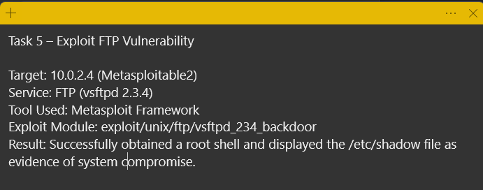
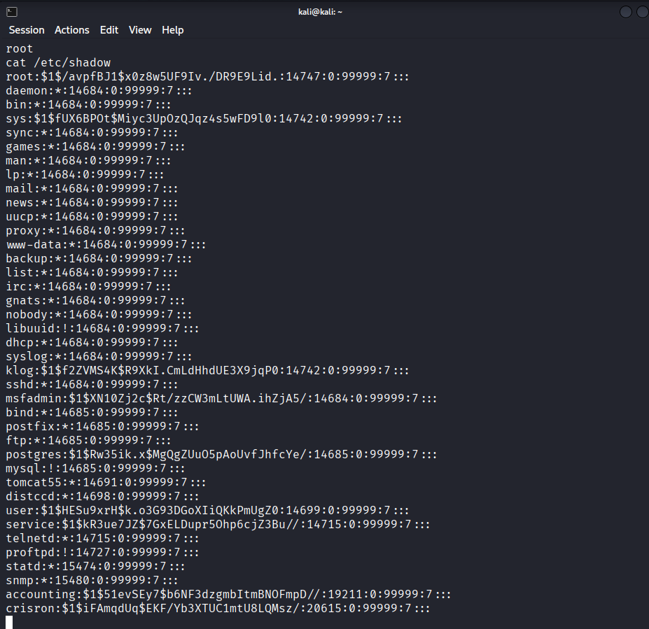

# Project 005 – Metasploit vsftpd Exploitation

## Overview

This project demonstrates the controlled exploitation of a known vulnerability in the vsftpd 2.3.4 FTP service running on an intentionally vulnerable Metasploitable2 system.

Previous reconnaissance with Nmap identified vsftpd 2.3.4 running on TCP port 21, and subsequent vulnerability assessment with OpenVAS identified the service as affected by a backdoor vulnerability. Using the Metasploit Framework, the vulnerability was exploited within an isolated lab environment to obtain a root-level shell on the target system.

Successful compromise was validated by accessing `/etc/shadow`, a protected Linux file containing local account password-hash information. This demonstrated the potential impact of a vulnerable network service leading to complete system compromise.

## Objectives

- Validate a previously identified vulnerability through controlled exploitation.

- Use the Metasploit Framework against an authorized lab target.

- Exploit the vulnerable vsftpd 2.3.4 FTP service.

- Obtain and verify root-level access to the target system.

- Demonstrate post-exploitation access to a protected system file.

- Document technical evidence of successful exploitation.

- Connect reconnaissance, vulnerability assessment, and exploitation into a complete security-testing workflow.

## Lab Environment

| Component | Role |
|---|---|
| **Kali Linux** | Penetration-testing system used to run Metasploit |
| **Metasploitable2** | Intentionally vulnerable Linux target |
| **Target IP Address** | 10.0.2.4 |
| **Target Service** | FTP – vsftpd 2.3.4 |
| **Target Port** | TCP 21 |
| **Exploitation Framework** | Metasploit Framework |
| **Exploit Module** | `exploit/unix/ftp/vsftpd_234_backdoor` |
| **Virtualization Platform** | Oracle VirtualBox |
| **Environment** | Isolated and authorized cybersecurity lab |

## Vulnerability Background

The target system was running vsftpd 2.3.4 on TCP port 21. This version is associated with a compromised distribution of the vsftpd source code that contained a malicious backdoor.

The vulnerable service had previously been identified during Nmap enumeration and was subsequently flagged during the OpenVAS vulnerability assessment. This made the service a candidate for controlled exploitation to validate whether the vulnerability could result in unauthorized system access.

Successful exploitation of this vulnerability can provide an attacker with command execution on the affected system. In this lab, exploitation resulted in a shell with root privileges, demonstrating the severity of running a compromised network service.

## Exploitation Methodology

The Metasploit Framework was used from Kali Linux to validate the vsftpd 2.3.4 vulnerability against the authorized Metasploitable2 target at `10.0.2.4`.

The Metasploit module used for the assessment was:

`exploit/unix/ftp/vsftpd_234_backdoor`

The exploitation process consisted of:

1\. Identifying the vulnerable FTP service on the target system.

2\. Selecting the Metasploit module associated with the vsftpd 2.3.4 backdoor.

3\. Configuring the module to target the Metasploitable2 system at `10.0.2.4`.

4\. Executing the module against the vulnerable FTP service.

5\. Obtaining a command shell on the target system.

6\. Verifying the privilege level of the resulting shell.

7\. Accessing `/etc/shadow` to demonstrate the security impact of the compromise.

All exploitation activity was performed against an intentionally vulnerable system within an isolated and authorized cybersecurity lab environment.

## Successful Exploitation

The Metasploit module successfully exploited the vulnerable vsftpd 2.3.4 service on the Metasploitable2 target.

Following exploitation, a command shell was obtained on the target system. The privilege level of the compromised session was verified as:

`root`

Obtaining root-level access represents a complete compromise of the affected Linux system because the root account has unrestricted administrative privileges.

The successful exploitation demonstrated how a vulnerable externally accessible service can provide an attacker with privileged access to the underlying operating system.

## Post-Exploitation Validation

After obtaining the root shell, access to a protected operating system file was used to validate the level of compromise.

The following command was executed:

`cat /etc/shadow`

The `/etc/shadow` file stores Linux account password-hash information and is normally restricted from standard users. The compromised root session was able to read the file successfully.

The output included entries for system accounts such as:

`root`

`daemon`

`bin`

`sys`

`www-data`

`mysql`

`postgres`

Access to this file demonstrated that the compromised session possessed sufficient privileges to access sensitive authentication information stored on the target system.

No password hashes were cracked as part of this project. The purpose of accessing `/etc/shadow` was to validate the security impact of the successful exploitation and root-level compromise.

## Evidence

### Exploitation Summary

The following evidence documents the target, vulnerable service, Metasploit module used, and successful root-shell result.

### Root Shell and Protected File Access

The following terminal evidence shows the root-level shell and successful access to `/etc/shadow` on the compromised Metasploitable2 system.

## Security Impact

Successful exploitation of the vulnerable vsftpd 2.3.4 service resulted in root-level access to the target system.

A compromise at this privilege level could allow an attacker to:

- Access sensitive system and authentication data.

- Read or modify protected files.

- Create, modify, or remove user accounts.

- Install additional malicious software or persistence mechanisms.

- Modify system configurations and services.

- Access data belonging to other users and applications.

- Use the compromised system as a platform for additional attacks.

The ability to access `/etc/shadow` demonstrated that exploitation of the vulnerable network service affected more than the FTP application itself. The vulnerability provided access to the underlying operating system with administrative privileges.

## Remediation Recommendations

The following actions would reduce or eliminate the risk demonstrated during this assessment:

- Remove the compromised vsftpd 2.3.4 software from affected systems.

- Replace vulnerable software with a trusted and supported version obtained from a verified source.

- Verify software packages and installation sources before deployment.

- Apply security updates and patches in accordance with organizational vulnerability-management procedures.

- Disable unnecessary network services to reduce the attack surface.

- Restrict access to FTP and other administrative or legacy services using appropriate network controls.

- Monitor systems and network traffic for indicators of unauthorized access.

- Investigate systems running compromised software for evidence of additional unauthorized activity.

- Perform vulnerability scanning after remediation to verify that the identified vulnerability is no longer present.

## Relationship to Previous Projects

This project builds directly on findings identified during earlier stages of the lab assessment.

**Project 002 – Nmap Enumeration** identified the FTP service running vsftpd 2.3.4 on TCP port 21.

**Project 004 – OpenVAS Vulnerability Assessment** identified the vsftpd 2.3.4 service as vulnerable to a known backdoor condition and documented the associated security risk.

**Project 005 – Metasploit vsftpd Exploitation** validated the vulnerability through controlled exploitation and demonstrated its potential impact by obtaining root-level access to the target system.

Together, these projects demonstrate a security-testing workflow consisting of:

**Reconnaissance and Enumeration → Vulnerability Assessment → Exploitation and Validation**

## Skills Demonstrated

- Metasploit Framework

- Controlled vulnerability exploitation

- Metasploit exploit-module selection and configuration

- Linux command-line interaction

- FTP service vulnerability analysis

- Post-exploitation validation

- Linux privilege verification

- Protected system-file access

- Vulnerability impact analysis

- Security risk assessment

- Remediation planning

- Cross-tool finding correlation

- Technical evidence collection

- Penetration-testing workflow documentation

## Conclusion

This project demonstrated the controlled exploitation of the vulnerable vsftpd 2.3.4 FTP service running on an intentionally vulnerable Metasploitable2 system.

Using the Metasploit Framework, the identified vulnerability was successfully validated and resulted in a root-level command shell. Access to `/etc/shadow` confirmed the security impact of the compromise and demonstrated the level of access that could result from an exposed vulnerable service.

Combined with the previous Nmap enumeration and OpenVAS vulnerability assessment projects, this exercise demonstrates the progression from service discovery and vulnerability identification to controlled exploitation and impact validation within an authorized cybersecurity lab environment.

