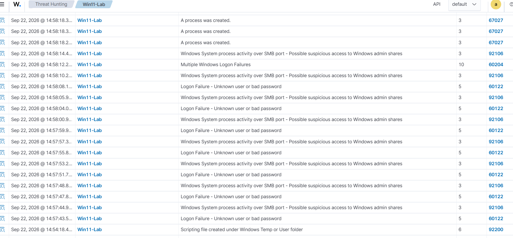
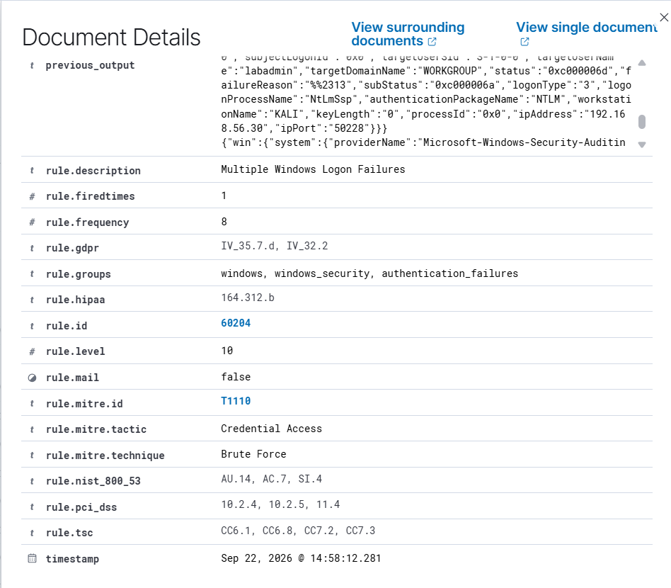
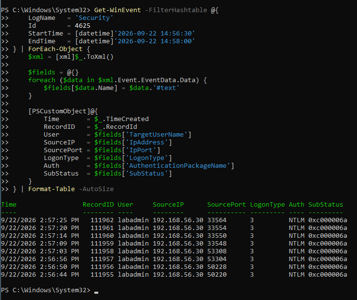
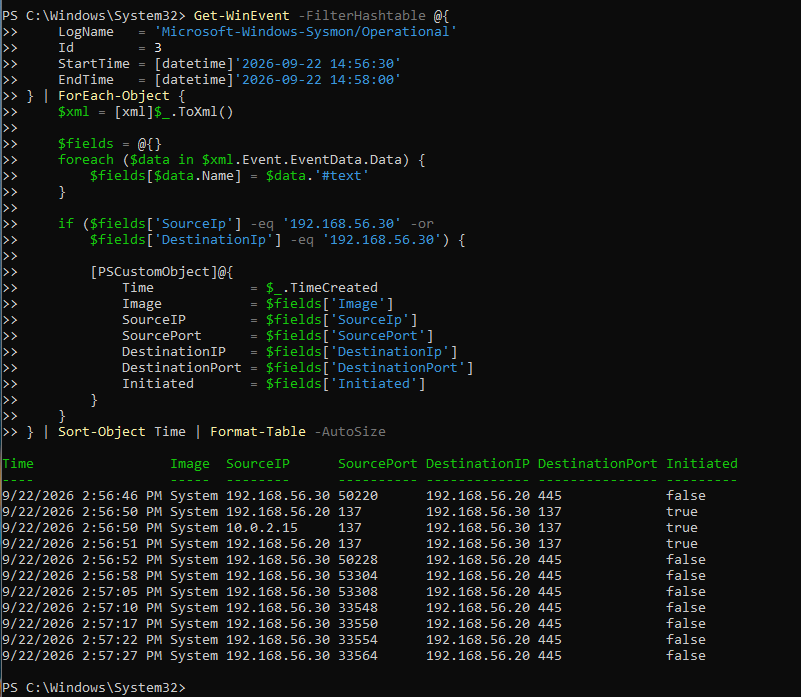
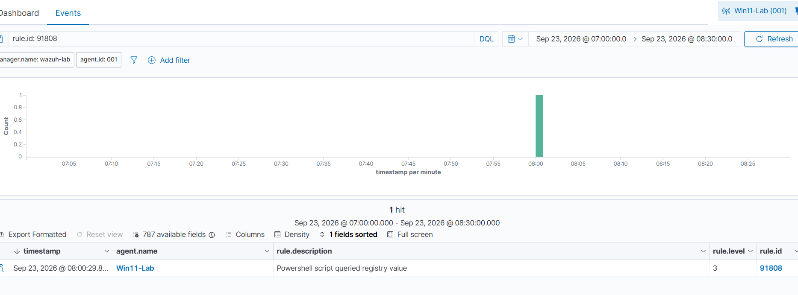
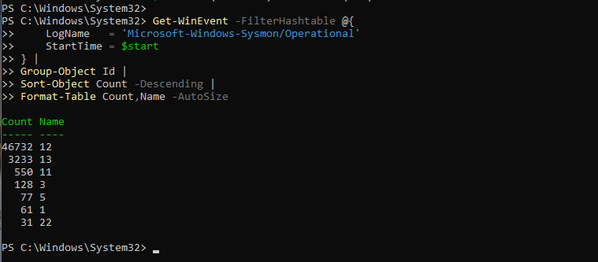
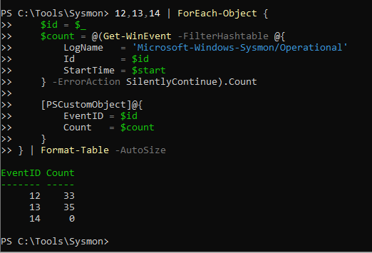

# Project 008 — SIEM / SOC Incident Investigation

## Overview

This project demonstrates a hands-on SOC investigation using Wazuh SIEM, Windows Security logs, Sysmon, PowerShell telemetry, and a controlled Kali Linux system.

Rather than stopping after generating an alert, I followed the activity through detection, triage, event correlation, scope analysis, detection-rule investigation, and incident reporting.

The primary investigation involved repeated failed SMB/NTLM authentication attempts against a monitored Windows 11 endpoint. Wazuh detected the individual authentication failures and later generated a Level 10 correlated alert after its built-in threshold of eight failures from the same source IP was reached.

I then correlated the Wazuh alerts with Windows Security and Sysmon telemetry to determine what occurred and whether the activity resulted in successful access or subsequent compromise.

**Investigation result:** The activity was limited to repeated failed authentication attempts within the investigated window. No successful remote authentication from the controlled source or evidence linking the attempts to subsequent remote execution or payload deployment was identified.

> **Lab Notice:** All activity documented in this project was intentionally generated within an isolated cybersecurity home lab for educational and portfolio purposes.

---

## Skills Demonstrated

- SIEM alert triage and investigation

- Wazuh alert and rule analysis

- Windows Security Event Log analysis

- Sysmon endpoint telemetry analysis

- Cross-source event correlation

- Authentication investigation

- Incident timeline reconstruction

- Scope and impact analysis

- MITRE ATT&CK mapping validation

- Detection-threshold analysis

- PowerShell Script Block Logging

- Telemetry tuning and noise reduction

- Detection-gap identification

- Evidence preservation

- SOC incident reporting

---

## Lab Architecture

| System | Role | SOC-LAB IP |
|---|---|---|
| `Kali-Lab` | Controlled attack simulation | `192.168.56.30` |
| `WIN11-LAB` | Monitored Windows 11 endpoint | `192.168.56.20` |
| `Wazuh-Lab` | Wazuh SIEM | `192.168.56.10` |
| `CYBERHOST1` | SOC analyst workstation / VirtualBox host | `192.168.56.1` |

The systems communicated through an isolated VirtualBox host-only network (`192.168.56.0/24`). Internet access used separate NAT interfaces when required for installation and updates.

### Monitoring Stack

- Wazuh 4.14.7

- Wazuh Windows Agent

- Sysmon 15.22

- Windows Security Event Logging

- PowerShell Operational Logging

- PowerShell Script Block Logging

- Kali Linux

- Oracle VirtualBox

---

## Investigation Summary

### 1. Reconnaissance Visibility

An initial Nmap SYN scan was generated from `Kali-Lab` against `WIN11-LAB`. No corresponding Wazuh alert was observed.

Because the lab relied primarily on endpoint telemetry and did not contain a dedicated network intrusion detection sensor, this was documented as a visibility limitation rather than evidence that the reconnaissance did not occur.

### 2. SMB Authentication Detection

Controlled SMB authentication attempts were generated against the `labadmin` account on `WIN11-LAB`.

Windows recorded the failed authentication activity as Event ID `4625`, including:

- Source: `192.168.56.30`

- Target account: `labadmin`

- Authentication: `NTLM`

- Logon Type: `3` (Network)

- Status: `0xc000006d`

- Substatus: `0xc000006a`

Wazuh detected the individual failures using Rule `60122`.

### 3. Detection-Rule Investigation

Three repeated authentication failures initially did not produce a higher-severity correlated alert.

Instead of immediately creating a custom rule, I examined the Wazuh ruleset and identified built-in Rule `60204`:

| Detection Property | Value |
|---|---|
| Rule | `60204` |
| Description | Multiple Windows Logon Failures |
| Level | `10` |
| Frequency | `8` |
| Timeframe | `240 seconds` |
| Correlation | Same source IP |
| MITRE ATT&CK | `T1110 - Brute Force` |

The earlier three-event test had simply not reached the existing detection threshold.

Eight controlled failures were then generated within approximately 41 seconds, successfully triggering Rule `60204`.

### 4. Cross-Source Correlation

Windows Security Event ID `4625` was correlated with Sysmon Event ID `3`.

All eight failed authentication events had corresponding inbound TCP/445 connections from `192.168.56.30`. The TCP source ports recorded by Windows Security matched the source ports recorded by Sysmon.

This established the following evidence chain:

`Kali-Lab → TCP/445 SMB → WIN11-LAB → NTLM authentication → labadmin → failed password → Windows 4625 → Wazuh detection`

### 5. Scope and Impact

After validating the alert, I investigated whether the activity progressed beyond failed authentication.

The investigation included:

- Windows Event ID `4624` successful-logon review

- Sysmon Event ID `1` process-creation review

- Sysmon Event ID `11` file-creation review

- Sysmon Event ID `3` network correlation

Successful logons observed shortly after the authentication sequence were local `SYSTEM` service logons (Logon Type `5`) and did not match the controlled remote source.

No evidence was identified within the investigated window linking the SMB authentication attempts to successful remote authentication, remote execution, or payload deployment.

---

## Detection Engineering and Telemetry Improvements

The project also uncovered two important monitoring lessons.

### Sysmon Tuning

The original Sysmon configuration generated excessive registry telemetry, including approximately 65,436 Event ID `12` events and 15,677 Event ID `13` events during the observed high-volume period.

This caused Wazuh Agent buffer saturation and warnings that events could be lost.

I tuned registry monitoring toward higher-value locations such as:

- `CurrentVersion\Run`

- `CurrentVersion\RunOnce`

- `HKLM\System\CurrentControlSet\Services\`

- `Winlogon`

- `Image File Execution Options`

During an approximately five-minute post-tuning validation period, registry telemetry decreased to approximately 33 Event ID `12` events and 35 Event ID `13` events without recurrence of the previously observed buffer saturation warnings.

### PowerShell Visibility

The investigation also identified that the Wazuh Agent was not collecting the PowerShell Operational event channel and that Script Block Logging was not enabled through the tested machine policy location.

I enabled:

`Microsoft-Windows-PowerShell/Operational`

and PowerShell Script Block Logging.

A controlled read-only registry query then generated Windows Event ID `4104` and Wazuh Rule `91808`, validating the complete pipeline:

`PowerShell → Script Block Logging → Event 4104 → Wazuh Agent → Wazuh Rule 91808 → SIEM Alert`

This PowerShell testing was performed as a post-incident telemetry validation exercise and was not part of the SMB authentication incident.

---

## Key Findings

1. **Repeated authentication failures were successfully detected and correlated.**

Wazuh Rule `60122` detected individual Windows failed-logon events, while Rule `60204` correlated eight failures from the same source into a Level 10 alert.

2. **Windows Security and Sysmon independently supported the same activity.**

The source IP and TCP source ports in Windows Event ID `4625` matched the inbound TCP/445 connections recorded by Sysmon Event ID `3`.

3. **The alert did not establish successful compromise.**

Follow-up investigation found no successful remote authentication from the controlled source and no evidence linking the authentication attempts to subsequent execution or payload deployment within the investigated window.

4. **The apparent authentication detection gap was actually a threshold condition.**

Inspection of Wazuh's built-in rules showed that Rule `60204` required eight authentication failures within 240 seconds from the same source IP.

5. **A genuine PowerShell telemetry gap was identified and corrected.**

PowerShell Operational events were not initially collected by the Wazuh Agent. Collection and Script Block Logging were enabled and then validated end-to-end with Event ID `4104` and Wazuh Rule `91808`.

6. **Telemetry volume affected collection reliability.**

Excessive Sysmon registry events saturated the Wazuh Agent buffer. Targeted Sysmon tuning substantially reduced the event volume while retaining monitoring of higher-value registry locations.

---

## Investigation Evidence

### Repeated Authentication Detection

The controlled authentication sequence produced eight failed Windows logons from the same source IP. Wazuh correlated the events and generated Rule `60204` — **Multiple Windows Logon Failures**.



The correlated alert reached Level 10 and mapped the activity to MITRE ATT&CK `T1110 - Brute Force`.



### Windows Authentication Evidence

Windows Security Event ID `4625` showed the eight failed NTLM network logons against `labadmin` from `192.168.56.30`.



### Sysmon Network Correlation

Sysmon Event ID `3` independently recorded the corresponding inbound SMB connections. The TCP source ports matched the source ports recorded in the Windows Security events.



### PowerShell Telemetry Validation

After enabling PowerShell Operational collection and Script Block Logging, a controlled registry query generated Event ID `4104` and Wazuh Rule `91808`.



### Sysmon Telemetry Tuning

The effect of tuning the Sysmon registry configuration was documented before and after the configuration change.

**Before tuning:**



**After tuning:**



---

## MITRE ATT&CK

| Technique | Description | Project Context |
|---|---|---|
| `T1110` | Brute Force | Wazuh mapping for the correlated repeated-authentication simulation |
| `T1012` | Query Registry | Wazuh mapping during post-incident PowerShell telemetry validation |

An individual failed-logon alert generated by Wazuh Rule `60122` was automatically mapped to `T1531 - Account Access Removal`. That mapping did not accurately characterize the simulated activity and was not adopted as the analyst conclusion.

This reinforced an important investigation principle: automated MITRE ATT&CK mappings should be validated against the underlying telemetry rather than accepted without analysis.

---

## Project Artifacts

```text

008-SIEM-SOC-Investigation/

├── Telemetry-Configs/
│   ├── sysmonconfig-project008.xml
│   └── wazuh-powershell-eventchannel.xml

├── Evidence/

│   ├── 01_Wazuh-Reconnaissance-Detection-Gap.png

│   ├── ...

│   └── 17_Windows-4625-SMB-Failed-Logon-Correlation.png

├── Logs/

│   ├── 2026-09-22_SMB-Failed-Logon-4625.json

│   ├── 2026-09-22_Multiple-Windows-Logon-Failures-60204.json

│   └── 2026-09-23_PowerShell-Registry-Query-91808.json

├── Reports/

│   └── Incident-Report.md

└── README.md
